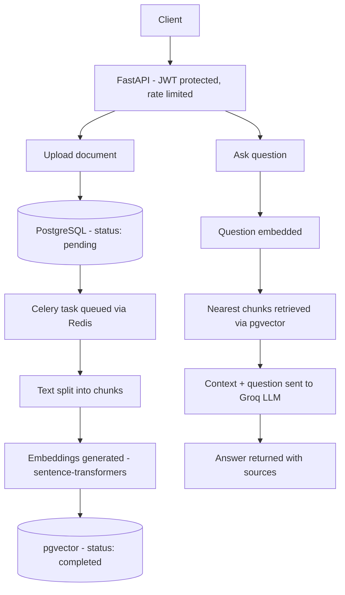

# AI Knowledge Base API

A Retrieval-Augmented Generation (RAG) API for building searchable, question-answerable knowledge bases. Users upload documents, the system automatically chunks and embeds them, and questions are answered by retrieving the most relevant chunks and passing them to an LLM as context.


## Features

- JWT-based authentication with access and refresh tokens, and secure password hashing (bcrypt)
- Document management with per-user access control (upload, list, view, delete)
- Asynchronous document processing (chunking + embedding) via Celery
- Semantic vector search using PostgreSQL + pgvector
- RAG-based chat endpoint using Groq LLM, grounded strictly in uploaded documents, with source attribution
- Rate limiting on authentication and chat endpoints to prevent abuse
- 19 automated tests covering authentication, authorization, and the full RAG pipeline (LLM calls are mocked)
- Fully containerized: API, worker, PostgreSQL, and Redis run with a single `docker compose up`
- CI pipeline via GitHub Actions running the full test suite on every push

## Architecture



## Tech Stack

| Layer | Technology |
|---|---|
| API framework | FastAPI (async) |
| ORM | SQLAlchemy 2.0 (async) |
| Database | PostgreSQL + pgvector |
| Background tasks | Celery + Redis |
| Authentication | JWT (python-jose, access + refresh tokens) + bcrypt |
| Rate limiting | slowapi |
| Embeddings | sentence-transformers (all-MiniLM-L6-v2) |
| LLM | Groq (llama-3.3-70b-versatile) |
| Migrations | Alembic |
| Testing | pytest, pytest-asyncio, httpx |
| Containerization | Docker, docker-compose |
| CI/CD | GitHub Actions |

## Running Locally with Docker

### Requirements
- Docker and Docker Compose
- A Groq API key (free at [console.groq.com](https://console.groq.com))

### Steps

1. Clone the repository:
```bash
git clone https://github.com/erbolboribaev/ai-knowledge-base-api.git
cd ai-knowledge-base-api
```

2. Create your environment file:
```bash
cp .env.example .env
```
Set `GROQ_API_KEY` and `SECRET_KEY` in `.env` to your own values.

3. Start the stack:
```bash
cd docker
docker compose up --build
```
This starts PostgreSQL (with pgvector), Redis, the API server, and the Celery worker, and applies database migrations automatically.

4. Open the interactive API docs:

http://localhost:8000/docs


## API Examples

### Register
```bash
curl -X POST http://localhost:8000/api/v1/auth/register \
  -H "Content-Type: application/json" \
  -d '{"email": "user@example.com", "password": "securepass123"}'
```

### Login
```bash
curl -X POST http://localhost:8000/api/v1/auth/login \
  -d "username=user@example.com&password=securepass123"
```
Returns both an `access_token` (short-lived) and a `refresh_token` (long-lived).

### Refresh access token
```bash
curl -X POST http://localhost:8000/api/v1/auth/refresh \
  -H "Content-Type: application/json" \
  -d '{"refresh_token": "<REFRESH_TOKEN>"}'
```

### Upload a document
```bash
curl -X POST http://localhost:8000/api/v1/documents/ \
  -H "Authorization: Bearer <TOKEN>" \
  -H "Content-Type: application/json" \
  -d '{"filename": "company_policy.txt", "content": "..."}'
```

### Delete a document
```bash
curl -X DELETE http://localhost:8000/api/v1/documents/<DOCUMENT_ID> \
  -H "Authorization: Bearer <TOKEN>"
```

### Ask a question (RAG)
```bash
curl -X POST http://localhost:8000/api/v1/chat/ask \
  -H "Authorization: Bearer <TOKEN>" \
  -H "Content-Type: application/json" \
  -d '{"question": "What is the company policy about?"}'
```

## Rate Limits

| Endpoint | Limit |
|---|---|
| `POST /auth/register` | 5 per minute |
| `POST /auth/login` | 10 per minute |
| `POST /auth/refresh` | 20 per minute |
| `POST /chat/ask` | 20 per minute |

Limits are keyed by client IP address.

## Running Tests

```bash
pip install -r requirements.txt
pytest tests/ -v
```

Tests require a separate test database, configurable via the `TEST_DATABASE_URL` environment variable. Rate limiting is disabled automatically during test runs.

## Project Structure
```


app/
├── api/v1/ # Route handlers (auth, documents, chat)
├── core/ # Settings, security, rate limiting, logging
├── db/ # Database engine and session management
├── models/ # SQLAlchemy models
├── schemas/ # Pydantic request/response schemas
├── services/ # Business logic (RAG, embeddings, auth)
└── workers/ # Celery background tasks
tests/ # pytest test suite
alembic/ # Database migrations
docker/ # Dockerfile and docker-compose.yml
```

## License

MIT
